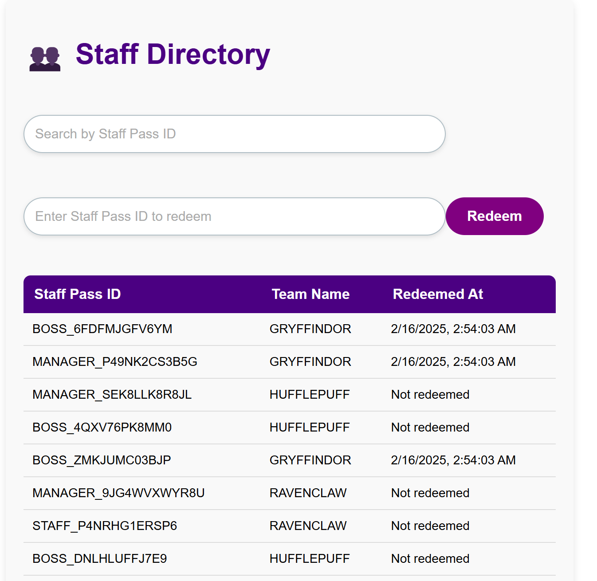

# Govtech GovWallet and GovSupply - TechnicalAssessment - Lo Yong Zhe

# Installation Guide for the Project

## **Prerequisites**

- **Node.js** (version 16 or higher)
- **npm** (comes with Node.js) or **yarn**
- **Git** (for version control)
- **VSCode** (recommended for development)

## **1. Clone the Repository**

```bash
git clone https://github.com/Reallyeasy1/Govwallet-TechnicalAssessment.git
cd Govwallet-TechnicalAssessment
```

## **2. Install Dependencies**

To install the dependencies, you would need to open 2 command prompts and use them separately for the frontend and backend.

## Via Command Prompt 1

```bash
# Backend dependencies
cd backend
npm install

```

## Via Command Prompt 2

```bash
# Frontend dependencies
cd frontend
npm install
```

## 2.1 Typescript installation

Also ensure that you have installed typescript on both the frontend and backend directories. The installation guide can be found here https://www.typescriptlang.org/download/.

## **3. Start the Development Servers**

## Via Command Prompt 1

```bash
# Start backend (from /backend)
npm run dev
```

## Via Command Prompt 2

```bash
# Start frontend (from /frontend)
npm run dev
```

The backend should run on **http://localhost:3000** and the frontend on **http://localhost:3001**.

## **4. Navigate to the Frontend Page**

- Open your browser and visit: `http://localhost:3001`
- The frontend interface should load successfully.
- **Click on 'Staff'** to view the Staff Directory.
- **Click on 'Redemption'** to access the Redemption page.

# Home page


# Staff page



# Redemption page


## **5. Verify Backend Functionality**

- Visit `http://localhost:3000/api` to check backend endpoints.

## **6. Testing**

- As for testing, simply execute the following steps from root

```bash
cd backend
npm run test
```
